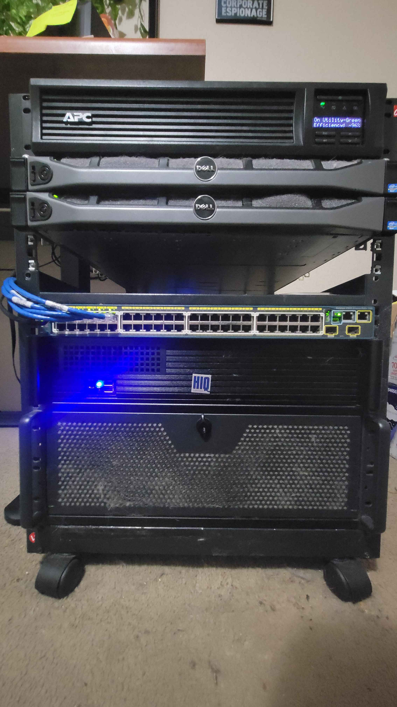

# Cyberlab - Homelab Infrastructure

Welcome to **Cyberlab** — my personal homelab playground for testing, learning, and breaking stuff (so you don’t have to).  
This repo documents the setup, configs, and automation for my homelab environment.

---

## 🖥️ Hardware Overview

### Dell PowerEdge R240 (x2)
- **Specs:**  
  - Xeon E5-2407  
  - 32GB RAM each  
  - 8 × 1TB HDD each  

- **Node 1 – Proxmox VE**  
  - Nvidia Quadro P600 GPU passthrough  
  - LXC containers (Arr stack)  
  - Linux KVM (Kali VM)  
  - RAIDZ10 → max performance (Plex/Jellyfin media servers)  

- **Node 2 – Proxmox Backup Server (PBS)**  
  - RAIDZ6 → double parity + storage efficiency  
  - Samba + Nextcloud file share  
  - Automated daily, weekly, monthly backups  

---

### Custom Build #1
- Intel i5 (4 cores), 32GB RAM  
- 2 × 256GB SSD  
- Roles: **Minecraft servers** + **Windows AD lab**  

---

### Rackmounted PC (Workhorse)
- Intel i7-9700K (OC 4.9–5.0 GHz, custom water loop)  
- RTX 2070  
- 32GB DDR4 RAM  
- Mixed drives for flexible workloads  

---

### Networking & Power
- Cisco Catalyst 2960-S switch  
- APC SMT1500 UPS  

---

## 📸 Screenshots

### Initial Setup

