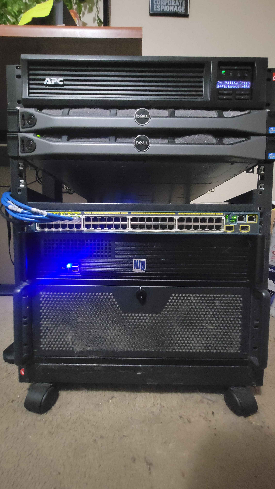

# Cyberlab - Homelab Infrastructure

Welcome to **Cyberlab** — my personal homelab playground for testing, learning, and breaking stuff (so you don’t have to).  
This repo documents the setup, configs, and automation for my homelab environment.

---

## 🖥️ Hardware Overview

### Dell PowerEdge R320 (X2)
- **Specs:**  
  - ~~Xeon E5-2407~~
  - Xeon E5-2470 v2 (MERRY CHRISTMAS)
  - ~~32GB RAM DDR4~~
  - 96GB RAM DDR4  (MERRY CHRISTMAS)
  - 8 × 1TB SAS HDD
  - Intel X520-DA2 (MERRY 10 GIGABIT CHRISTMAS)

- **Node 1 – Proxmox ARR**  
  - Nvidia Quadro P600 GPU passthrough  
  - RAIDZ2 → Storage capacity in favor of speed.
 
- **Node 2 – Proxmox FILES**
  - RAIDZ2 → Storage capacity in favor of speed.
  - Windows AD ENV
  - PBS
  - ~~SMB/CIFS Share~~
  - Minecraft Servers

- **VM – Proxmox PBS**
  - Trying to keep the storage as empty as possible so I run very lean backups daily backups. 
  - 256 GB allocated, aggressive purge/retention rules to keep 1 backups per vm/lxc.
  - Additonally offload configs of each node onto a flash drive so in case of OS failure I can reinstall on a fresh drive import my configs and restore to its former self.

---

### Custom Build #1
- ~~DECOMMISSIONED, moved all servers to files~~
- ~~Intel i5 (4 cores), 32GB RAM~~
- ~~2 × 256GB SSD~~
- ~~Roles: **Minecraft servers** + **Windows AD lab**~~
- Added 1G NIC (Intel 82576 Controller) 2x RJ45
- Now running OPNsense (added Zenarmor to turn it into NGFW!) 
---

### Rackmounted PC (Workhorse)
- Intel i7-9700K (OC 4.9–5.0 GHz, custom water loop)  
- RTX 2070 8GB VRAM
- 32GB DDR4 RAM  
- ~~Mixed drives for flexible workloads~~
- Removed 1 TB HDD, added 1 256GB SSD, setup 4 drive raid pool in RAID10 for /home/ partition. (overkill? yes. fun? also yes.)
- Reinstalled Arch for latest drivers recently.

---

### Networking & Power
- Cisco Catalyst 2960-S switch  
- APC SMT1500 UPS  

---

## 📸 Screenshots

### Initial Setup

